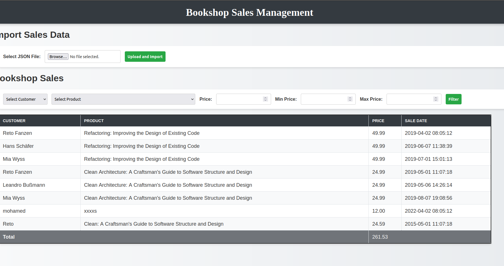

# book-store-sales
 KISS - Keep it simple stupid performant and secure! is somehow applied here 
 this test  is a simple PHP application for managing bookshop sales and this  solution includes:

    A database schema optimized for storing customer, product, and sales data.
    A PHP script to import and display JSON data with filters for customer, product, and price.
    A table displaying filtered results with the total price.

If you have any questions, feel free to reach out. 
## Screenshot
